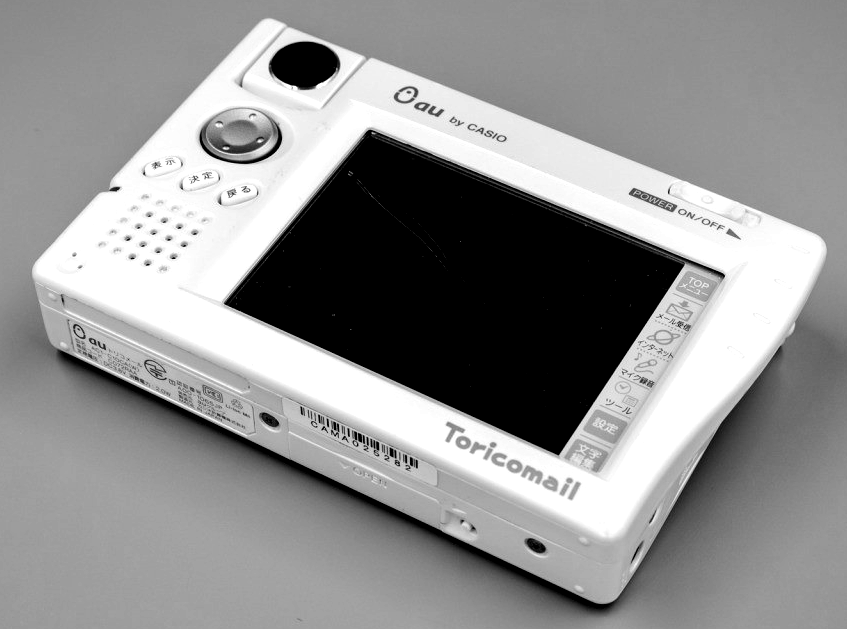
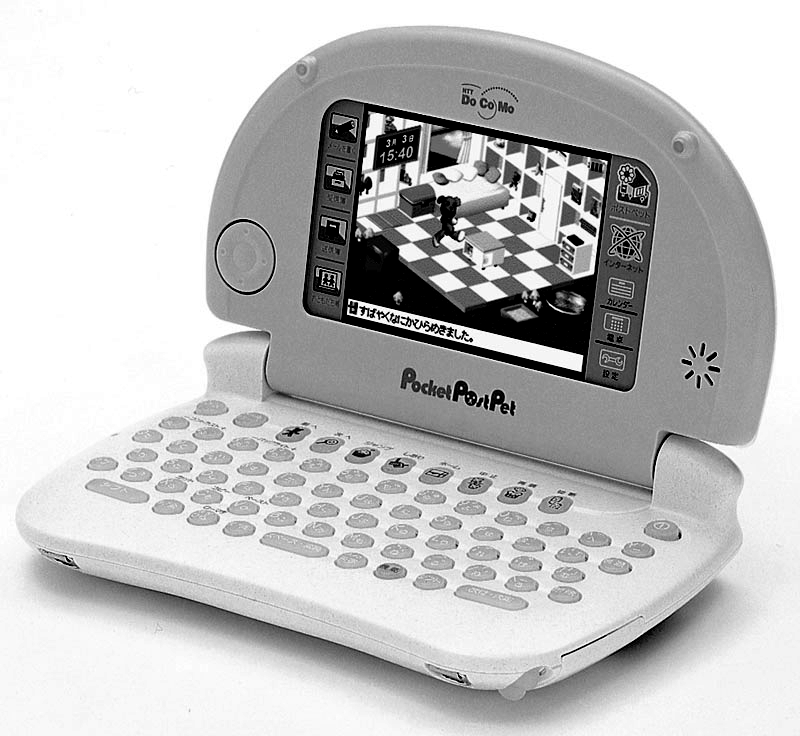

# 中国智能手机社区的启蒙老师：卡西欧MC21
*卡西欧MC21——一款作为手机配件出现的“数码相机”，是如何在发烧友们的努力下成为一款全功能的掌上电脑，又是如何启发中国的移动设备社区的呢？本文将为你揭开谜团背后的真相。*

故事要从中国的掌上电脑社区的起源说起，提起中国的掌上电脑市场，许多人都会联想起像商务通、文曲星等电子记事本和电子词典产品，但现代意义上的、可以安装软件的“掌上电脑”型PDA的启蒙，则应当追溯到微软的Windows CE 2.11，从这一版本开始，微软和国众、联想等中国和台湾地区的厂商开发出一系列支持中文的掌上电脑产品，此外，IBM中国研究院也开发出基于Palm系列PDA的中文版WorkPad等产品。但由于价格、市场等多方面的原因，这一系列早期的掌上电脑产品都不是太普及。

大概到了2002年、2003年，中国的掌上电脑社区才逐渐开始成型、以台湾厂商神达为代表的一系列产品，包括神达Mio 338、558等Pocket PC，其价格都跌入3000块人民币以内，用户数量才开始逐渐增多。但相比当时的收入水平来说，这些掌上电脑产品的价格仍然相对昂贵，即使到了2005年，毕业生的实习工资也往往只有800元每月，而对于学生群体来说这些产品的价格则更显得高不可攀。

卡西欧MC-21，这款名字取意自MessageCam（短信照相机）的产品实际上早在2000年年底就已经出现，不过对于中国的爱好者来说，开始认识这款产品大概要等到一年半之后的2002年初。

## 香港玩家的发现
最早发现这款产品利用价值的，是来自于香港的玩家，2002年四月，香港玩家Happy Corner的一篇卡西欧MC-21活用帖《玩盡MC-21！！相機變身Windows CE PDA秘技大公開》[^1]，是目前互联网上能找到的最早的MC-21应用教程，代表着中文掌上电脑社区第一次发掘这款设备的价值。在此之前，MC-21在香港仅仅是作为“生果台”Orange（即后来的香港3G）为西门子手机推出的照相机配件。而在这篇帖子中，MC-21摇身一变，成为一款功能丰富的掌上电脑。

在Happy Corner帖子的最后，提到了一位对中文掌上电脑社区影响深远的人物，Micro Cheng，一位旅居日本的华人工程师，当时他正就职于日本一家开发词典软件的公司。

如果我们这时再来回顾一下Micro Cheng的个人主页[^2]，会发现他对各类移动操作系统涉猎及其广泛，在其软件栏目中不仅介绍了EPOC、PalmOS等早期的移动操作系统，也包括了Android、iOS等目前流行的移动操作系统，堪称是中国移动软件社区的开山鼻祖之一。

MC-21出现的时机，正是移动网络从2G的GSM和CDMA IS-95转向以GPRS和CDMA 2000 1x为基础的2.5G移动网络的时间点，随着数据传输速率的大幅提升，许多运营商希望能够有功能丰富的设备来展现其网络性能，如发送带图像的多媒体短消息和收发电子邮件（在日本，这款设备叫做Toricomail，即多彩邮件）。由于当时的电子设备集成度有限，为了保持手机的体积更小，运营商往往提供功能强大的多媒体外设，而不是直接将各种功能统统塞进手机里面。

## 日本开发者的贡献
日本的Windows CE开发商Tillanosoft可能是最早发现将MC-21改造为全功能掌上电脑的开发者。在Tillanosoft网站上曾经刊载过一篇关于Pocket Post Pet的破解文章[^3]。

Pocket Post Pet是Sony开发的一款电邮宠物，集成了电子宠物和电子邮件的功能，当年任天堂的宠物小精灵正在日本掀起一股电子宠物的热潮，Pocket Post Pet内置了名为Post Pet的软件，可以让电子宠物充当传递电子邮件的“邮递员”，可以算是社交类游戏的先驱了。而Pocket Post Pet使用了与MC-21相同的Windows CE 2.12平台，因此两者的破解方法基本相同。在Tillanosoft的网站上，同样可以找到关于MC-21的文章[^4]。

实际上，作为当时日本颇具实力的移动平台软件开发商，Tillanosoft不仅提供了Pocket Post Pet的CE化方法，也提供了相当数量的CE系统优化软件和实用工具，像Pocket Notepad，Small Tweak，tGetFile等软件都曾经在中国的玩家和开发者中间流行过一段时间。除此之外，同样来自日本的开发者还有开发SQ Pocket和GSFinder+TQ的MONO-Q，开发注册表编辑器Tascal Regedit的TascalSoft，以及开发开源笔记软件Tombo的Tomohisa Hirami，都曾给中国的开发者带来不少启发。

## 抢滩登陆的“洋垃圾”
在MC-21被香港玩家发现的大半年之后，大陆掌上电脑社区的MC-21热潮才正式开始。作为国内主流IT媒体的太平洋电脑网就以一篇《洋垃圾也能热卖？Casio MC21销售之迷》[^5]详细的报道了MC-21销售的火爆。

以“白菜价”涌入中国市场的MC-21，在内地的掌上电脑玩家中间引爆了一枚震撼弹，一套配有128M MMC卡、到手即用的MC-21套装在当时的售价是450块左右，这一价格要低于像文曲星NC1020这样的高档电子词典，但功能却远远超过后者，让许多囊中羞涩的爱好者欣喜若狂。

当年中国内地的Palm OS开发者社区中已经涌现出一批高水平的开发者，如著名的CJKOS及其开发者杜永涛，巨硬输入法及其作者UGLee，像国外的同行一样，中国的Palm OS开发者擅长于开发严肃用途的工具类应用，其作品多数为收费的商业软件。但MC21的汉化包一直是由社区以免费的形式提供，并会预装一系列通常为盗版的游戏软件，虽然总有商家（爱好者口中的“奸商”）以此牟利或抬价，但大多数时候都可以在爱好者社区免费获取。

现在看来，MC-21以低价进入市场的情形，对整个中国的掌上电脑市场乃至智能手机市场都带来了相当深远的影响，它让大陆的爱好者们第一次了解到什么样的数码产品是“可承受的”，特别是对年轻的学生群体而言，当时市面上两三千块钱的Pocket PC或Palm OS掌上电脑距离他们的承受能力仍然有一段距离，而MC-21与其前后相继进入千元以内的Palm IIIxe，Handspring Visor等产品一起，将中国的掌上电脑社区推向了一个新的高度，而其千元之内的定价，也为后来千元智能手机的出现买下了伏笔。

## 在线社区的形成
但在当时流行的诸多“千元PDA”中间，MC-21最为受到移动开发者的欢迎，2000年左右，微软曾经在中国推广过名为“维纳斯计划”的Windows CE互联网机顶盒方案，最终这个项目没有获得成功，但却积累了相当数量的中文开发资料，并培训了最早的一批Windows CE开发者，因此相比同时期的Palm OS，中国的开发者们对Windows CE更加感到熟悉。

随着平价的MC-21在学生群体中的火爆，Windows CE开发者团队中间又有了新生力量——业余的学生开发者。当年一只名叫“三人组合”[^6]的团队就曾经开发过一款名为FontInMMC的软件，从其留下的邮箱地址来看，应该是一只来自福建农林大学的开发团队。

国产的Windows CE开源软件也开始出现，由张帆开发的JFDict[^7]就是其中的佼佼者。此时文曲星、快译通等电子词典厂商已经拥有相当数量的用户群体，各类词典软件往往是各类掌上电脑的“装机必备”。除了JFDict，同样针对Windows CE的MDict和针对Palm OS的ZDict，也是当时最为热门的掌上电脑软件。

当年社区中的热门话题与今天的智能手机论坛别无二致，软件资源下载、汉化、自制软件的讨论都相当活跃。“以商养坛”的社区经营模式也开始出现，即由商家建设在线讨论区，而依靠社区的热度来促进销售，54ps论坛就是MC-21社区中最为活跃的商家论坛之一。类似的模式随后也出现在其他主题的论坛中，恩山无线论坛可能是这一模式最为成功的例子。2005年时作者的第一套无线网络设备就是从恩山的淘宝店购得，而今天，恩山无线论坛已经成长为中文社区中最为活跃的无线网络技术讨论区。

## 延续至今的用户习惯
MC-21社区中的又一大特色，是模拟器游戏的流行。由于MC-21的售价低于市面上大部分便携式游戏机，利用模拟器将MC-21变为一台掌机就显得十分具有性价比。在当年相当活跃的MC-21社区PDAXX中，就有一个专门讨论模拟器游戏的版块。

对掌上设备模拟游戏机的热爱在中国的玩家社区中延续至今，并催生了一系列相关的产品。2006年，华芯飞成立了丁果科技并推出了丁果A300掌上游戏机，由于其强大的模拟器功能，甚至在欧美的数码爱好者社区中都有着数量不菲的爱好者。

而更近一些的产品，则有小鸡模拟器和GPD Win。特别是GPD Win让人联想起当年的MC-21爱好者社区和袖珍笔记本社区之间相当紧密的联系，当年袖珍笔记本爱好者的聚集地电池专门网论坛，就专门开设了MC-21的讨论区。今日的GPD Win，或许正是当年电池专门网的精神继承者。

## 互联网手机的先驱
MC-21社区的活跃一直持续到2008年中国互联网手机诞生的前夜。魅族M8，一款同样基于Windows CE系统、同样有着远低于同类产品价格、同样有着庞大发烧友社区的国产手机在这一年的秋天横空出世，拉开了中国互联网手机的大幕，也宣告“洋垃圾”掌上电脑历史使命的结束。

MC-21究竟对中国互联网手机的诞生产生了多少影响可能以无从查证。但我们看到，MC-21定义了什么叫做“可承受的”数码设备，树立了廉价且多功能的数码产品的标杆，学生和年轻人作为其最具代表性的消费群体，与日后“千元智能手机”的受众高度重合。

由于MC-21预装的系统功能并不完整，为了挖掘MC-21的应用潜力，爱好者们制作了许多“刷机包”、“汉化包”，成为中国移动设备社区中定制系统最早的实践者。这一情形延续到后来的Android智能手机市场，像MIUI这样定制系统中的佼佼者更是成为今日智能手机上举足轻重的厂家。而一些早期玩家所实现的定制功能，也被后来的各类定制系统所借鉴。

同时，MC-21为中国早期的移动App开发者提供了极好的“练习场”，许多在Windows CE 2.11上的开发经验都被带到包括魅族M8等后来推出的Windows CE设备上。许多商用PDA产品，比如快递PDA、餐厅点菜宝等的开发，也受益于社区中丰富的人才储备。

而包括笔者在内，许多以MC-21启蒙的移动开发者如今正活跃在智能手机开发一线。在智能手机仍然曲高和寡的年代，MC-21以极低的学费教会了这批发烧友们移动APP开发和设计的诸多基本要素，这可能是这款古老的数码玩具带给我们最有价值的财富了。

[^1]: 玩盡MC-21！！相機變身Windows CE PDA秘技大公開 http://web.archive.org/web/20021202083003/http://www.happycorner.com.hk/sp003.htm
[^2]: Micro Cheng https://www.micro-cheng.com/
[^3]: ポケットポストペットで Windows CE http://web.archive.org/web/20050514022357/http://www.geocities.jp/windowscelab/popope.html
[^4]: CE化トリコメールでの文字入力 http://web.archive.org/web/20050429053946/http://www.geocities.jp/windowscelab/toricomail.html
[^5]: 洋垃圾也能热卖？Casio MC21销售之迷 https://arch.pconline.com.cn/digital/textlib/pda/buy/10303/141400.html
[^6]: 欢迎光临三人组合网 http://web.archive.org/web/20051119012432/http://210.34.80.101/zsb/abin/ceedit/
[^7]: JFDict软件主页 http://jfdict.sourceforge.net/