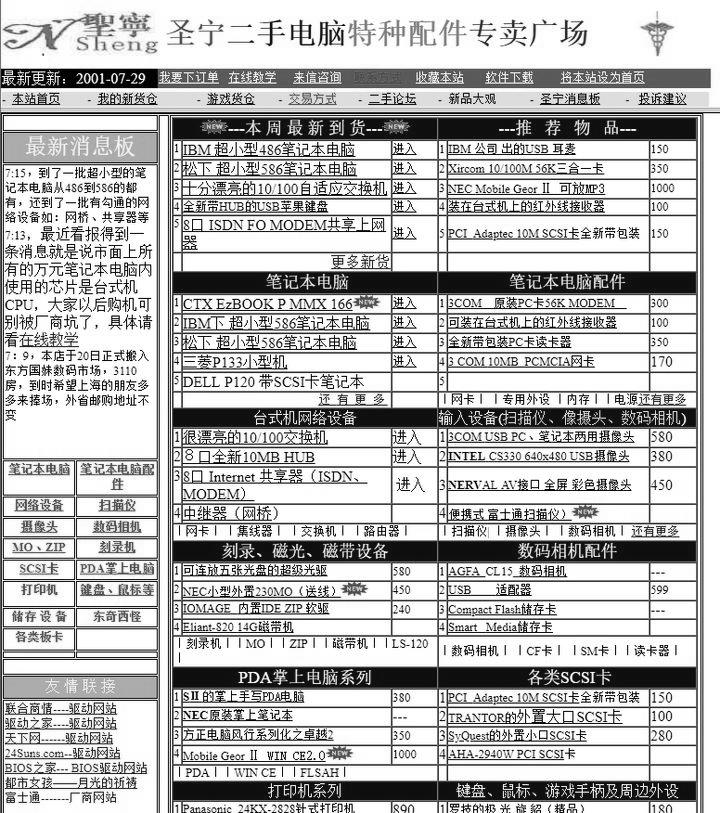
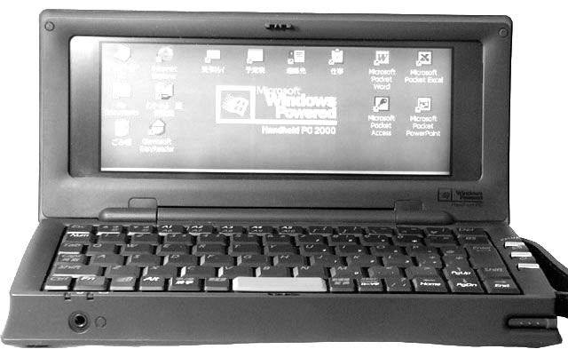
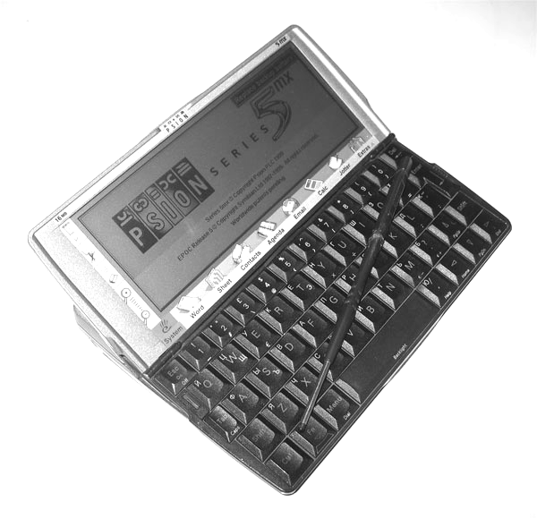

# 中国笔电社区的启蒙老师：手持电脑（HPC）与中文社区
当我们重新审视2000年之后的十年间，中国移动数码社区的脉络的时候，我们发现无论是上网本、UMPC还是Windows平板，乃至后来的GPD Pocket，其社区都可以追溯到一个早在2000年时就已经被微软放弃的产品——Handheld PC（下文简称“HPC”）。像以“小萝卜头”为代表的日系小本一样，HPC同样构建了今日中文世界里人们对“笔记本电脑”的认知和偏好。

## 史前时代
究竟中文世界什么时候开始接触到HPC已无从考据，目前能找到的最早关于HPC的报道是2000年10月的[^1]，HP Jornada 688很可能是市面上唯一一款中文版HPC Pro系统的机型，按照当时8000元的售价，恐怕是只有少数外企能够用到。

雷飏可能是中国大陆最早的Windows CE开发者 另一个中文世界接触到HPC的证据，则是早年中关村传奇人物，金山词霸开发者雷飏的CE-Star，1999年3月7号，CE-Star正式上线，之后，金山词霸的Windows CE版本在1999年5月1号发布，而第一个来自中文世界的游戏，则可能是苏以雷的四川省麻将。

而这时对中国的IT行业影响最为深刻的大事件之一，则是CE-Star上线后的三天，微软联合联想、海尔、步步高、裕兴、TCL等电脑、家电，特别是VCD和学习机行业的龙头共同发表了以Windows CE为基础的网络机顶盒计划——维纳斯计划。90年代中期视频点播（VOD）在西方国家的流行，而紧接着的.COM热潮，则让当时的互联网企业热衷于将机顶盒作为下一代上网设备和进军新兴市场的利器（我的《追寻ARM的起源——Acorn电脑简史》一文[^2]也有提到机顶盒），维纳斯计划几乎第一时间成为中国的互联网社区关注的焦点，随之而来的，则是后来的互联网“名嘴”方兴东[^3]、邓永强[^4]等人激烈的唇枪舌战。虽然维纳斯计划仅仅一年之后就草草收场，但这一时期引进的开发资料和受过训练的开发者，为之后几年Windows CE和Windows Mobile在中国的火热买下了伏笔，而“维纳斯计划”所包含的产品形态——互联网机顶盒，在10年之后的2010年代化身为“安卓盒子”转世再生[^5]。

## 圣宁与Hi-PDA
与卡西欧MC-21、日系小笔记本和黑莓一样，HPC社区在中国的真正建立，依靠的还是“地下渠道”，2001年前后，几个退伍军人在上海现代电子城开了一家名为“圣宁”的小店，专门卖“洋二手”“洋垃圾”电子产品，并在中国最早的主机服务提供商虎翼网（51.net） 上设立了自己的主页——pcps.51.net，很快，他们的网店就以“新奇特”的特点在发烧友之间积攒了不少名气，其中的一批NEC MobileGear II，成了中国HPC社区的第一个“爆款”，不到1000元售价的NEC MobileGear II，却可以播放MP3，内置了包括Pocket Access在内的完整的Pocket Office软件，还有几乎是全尺寸的键盘。

到2002年春天，在中国最早的PDA论坛Hi-PDA上，已经聚集起不少HPC的粉丝，这其中就包括后来PDAFans的HPC版版主hicq[^6]；在Hi-PDA上我们还可以找到中文社区中最早的HPC心得贴[^7]，其中提到的软件基本上涵盖了PDA以至于若干年之后智能手机的主要功能

1. 看书---EasyReader
2. 理财---Cash Organize
3. 新闻---AvantGo
4. 字典---PocketDict (即金山词霸)
5. 发短信---WinPhone
6. 浏览器---ftxBrowser
7. 网络配置---HPC Profiles
8. 聊天----MSN. HZMsn. Yahoo
9. 计事本---HPC Spell
10. 表格---pTab
11. 学英语---SuperMemo
12. 英语发音---CETalk
13. 压缩---Buseful Zip
14. Plus----Microsoft Plus( 画图.看图.PIM..)
15. Pocket DOS

当然也有许多颇具新意的应用类帖子，比如说有的帖子[^8]就实验了用HPC作为车载GPS导航仪。

## PDAFans
PDAFans成立于2002年12月1日，在成立之初，PDAFans就显示出与Hi-PDA、易选择等老牌PDA论坛的不同，PDAFans的Pocket PC软件和WinCE 2.11专区在短短的几个月内就积累了数千篇帖子，而Palm板块则一直没有发展起来，从此之后Windows CE相关的内容就一直是PDAFans论坛的特色内容。

相比Hi-PDA的“技术流”，PDAFans的运营显得很接地气，许多资源贴为新手用户准备了软件下载和新手引导内容，让新用户可以更容易的入门，这一点对于像HPC这样的小众平台来说则特别重要。

相比Hi-PDA，PDAFans对新手求助和交易贴都更加友善。到2004年，PDAFans的HPC论坛已经成为中文世界中气氛最好，讨论最热烈的HPC论坛，而一年之后HPC市场在中国的爆发，也将在这里引爆。

## JFDict和MDict
正如同前一段时间新闻中所报道的《日本高中生自制Win10电子辞典，为在学校看兽娘》[^9]一样，当时HPC的许多买家，也是为了拿它充当“电子辞典”的在校学生，雷飏在开发CE-Star的同时，也为Windows CE开发了一个“金山词霸”的简易版本，但这一版本的金山词霸收词数量相当有限，词库也不可以更换，而2002\~03年间出现的两款应用，让HPC真正成为市面上最强大的“电子词典”。

第一款软件是张帆发布于2003年4月的JFDict，这款软件对系统的要求很低，几乎所有的Handheld PC都可以运行它，因此几乎在第一时间就引起了HPC和MC21社区的注意，由于MC21在相当长的一段时间里不能运行MDict，因此JFDict几乎成了MC21的“标配”，更多MC21的故事，可以看我的另一篇文章：《中国智能手机社区的启蒙老师：卡西欧MC21》。

值得一提的是，JFDict是一款开源软件，其代码至今仍可以在SourceForge上下载到[^10]，与之同样出在2003年上半年发布的，还有中国开源社区传奇之一的胡正开发的星际译王（StarDict），当时正是宽带网络在中国开始普及的阶段，浏览外文网站的需求日渐增加，再加上金山词霸这样的词典软件和“文曲星”等硬件电子词典的火爆，让许多中文开发者都投入到词典软件的开发中。

而另一款在HPC社区中流行的词典软件，则是Octopus Studio（Rayman Zhang）发布的MDict[^11]，最初的MDict只支持Pocket PC 2000和2002，因此只在Pocket PC社区中小范围的传播，2003年5月初的MDict 1.1加入了两项巨大的改进——继承了MBar屏幕取词功能，并且支持HPC，从此MDict进入了一个快速流行的时期。

按照现在的话来说，MDict在2003年的开发可谓相当“敏捷”，在5月发布1.1到第二年1月发布2.0这8个月的时间里，发布了4个正式版本和7个测试版本，增加了许多实用的功能和词典，并加入了对星际译王词典的转换功能。MDict在这段时间内的人气迅速蹿升，与Palm上的KDic、ZDic一样，MDict的词典格式成为PocketPC电子词典的事实标准，随着MDict被移植到iOS和Android平台，至今仍有相当数量的爱好者。

## 2005：大船靠岸
而HPC在中国真正火爆的开始，则要等到2005年，这时，大批国外淘汰的HPC开始以各种渠道进入中国市场，按照后来“图吧垃圾佬”们常用的说法，这一年是“大船靠岸”了。

最早“上岸”的HPC机型，是NEC MC/300HC，虽说300HC出自HPC最大的生产厂家NEC，但NEC官方却从未正式销售过这款产品。它的真实身份，原本是为一家名为CELUX的二手奢侈品店定制的会员礼品。2002年夏天花费20万日元（约人民币13358元）成为该店会员，就可以免费获得这款HPC。

带有Louis Vuitton标志性方格图案的300HC，在进入中国时其蒙皮通常没有被保留下来 2005年2月，一大批几乎全新成色的300HC被当作“洋垃圾”运入中国，当时国内Windows CE掌上电脑最为集中的PDAFans论坛的HPC版版主hicq发现了这款机器，并开始在PDAFans和TomPDA等论坛上以999元的价格销售这款机器。

因为推出的时间较晚，所以这款机型的配置颇高，有300Mhz的Intel PXA 250 ARM处理器和32M内存，相比当时许多平价的Pocket PC来说也不逊色，而价格甚至还要低一点，而且这款机型还具有一个全尺寸的USB口，可以连接键盘、鼠标、数码相机和U盘等外设，很快就在PDAFans论坛上聚集了不少用户。

而相当重要的一点，300HC在中国的用户数量很可能比在日本还要多，因此现在在互联网上搜索这款机型，我们能找到的资料基本上都是中文的，而唯一的英文[^12]和德文[^13]介绍，则是来自于国内的网友Joe Chow。

我们并不确定此时在日本本土是否正好赶上退役的周期，但我们确实看到随着NEC 300HC的日渐升温，越来越多的HPC出现在中国的线上论坛和交易平台中，这些机型虽然配置没有300HC高，但价格却不断地刷新着人们的观念。

4月，名为wjqjames007的网友开始在PDAFans上组织团购日立PERSONA HPW-200JC，这款Windows CE 2.0，100Mhz SH3处理器的机型虽然软件远不如300HC丰富，但售价却也算公道，只要380块钱，以电子词典的价格买到具备彩屏和全尺寸键盘的HPC，大大拉低了进入这个HPC玩家圈子的门槛，把不少原本犹豫不决的观众“拉下了水”。

日立的HPC通常使用日立自己开发的Super H系列CPU，虽然软件略少，却算得上经济实惠的选择 8月，日本电信运营商DoCoMo向NEC定制的Sigmarion II出现在著名的二手电子产品销售商石坚高端的网站上，这款机型的配置与300HC相仿，只是CPU换成了200Mhz的NEC VR4131 MIPS处理器，而460元的价格让这款机型成了2005年下半年最有性价比的HPC机型。

虽然Sigmarion III（常被简称为SIII）才是HPC心目中的玩家的梦幻之选，但SII因为其便宜的价格最终被更多人购买 11月，TomPDA的商家韦立果再次刷新了HPC市场的价格下限，只要168元的飞利浦Velo 500出现在人们的视野中，相比之前的几款HPC，Velo 500其实是一款更老的机型——只有75Mhz处理器、16MB内存和黑白屏幕，但相比其他的几款机型，其体积更接近普通的电子词典，而且可以使用便宜的5号镍氢充电电池，加上跌破天际的售价，让众多TomPDA坛友纷纷“败家”。

2006年，是中国的HPC社区最为活跃的一年，越来越多的商家意识到HPC市场的潜力，而更多型号被引入市场，这时新型号首先出现的地方从PDAFans转向TomPDA的交易平台，而PDAFans则仍然是最为活跃的讨论社区。

NEC MC/R700是一款“亚笔记本”型的设备，作为曾经的HPC“机王”，它的扩展能力非常强大，同时具有CF卡、PC卡和全尺寸USB，在2006年初，不到300元的售价让它成为国内最流行的型号之一。

TomPDA上“数码广州”2006年6月开卖的HP Jornada 690，Jornada 690的体积较NEC的MobileGear系列略小，但仍然使用了较为舒适的键盘。是许多偏好小体积却又不满Velo 500孱弱性能的爱好者的最爱。

## Psion“野味”
同样是在2005年初，与使用Windows CE系统的HPC登陆中国的同时，TomPDA上也出现了使用EPOC（Symbian系统的前身）系统的TomPDA，而其中出货量最大的卖家，是TomPDA上的“胜记野味”——虽然听起来像是一家食品店，但卖的却是“数码野味”。

相比Windows CE系统HPC的实用，EPOC系统的Psion HPC确实更像是“野味”——美味但不充饥，由于中文支持远不如Windows CE完善，Psion系统的玩家始终聚集在一个小圈子里，而中文世界里讨论EPOC最早的Hi-PDA，则是EPOC玩家的大本营。

对于许多国内的玩家来说，Psion 5MX还有一层特殊的含义，Psion 5MX的贴牌版本爱立信MC218曾经出现在1999年刘德华为爱立信拍摄的决策篇（沙滩篇）[^14]广告中，被许多爱立信粉丝视为“终极神器”。

不过由于有限的应用场景和卖家飘忽不定的定价策略，Psion系列Handheld PC最终只局限在一个小圈子里，并没有大范围的在线上社区流行。如果你对Psion及其PDA感兴趣，可以看我的另一篇文章：《PSION简史——Symbian的史前时代》[^15]。

## “机王”与“山寨”
2007年后的HPC市场显得有些乏善可陈，随着北京奥运会的临近，移动EDGE网络已经基本覆盖全国，而3G网络也开始铺设，而HPC由于浏览器版本较旧、QQ等网络应用不够完善而日渐缺乏吸引力，虽然HPC具有续航时间长、瞬间开机这样的优势，许多玩家还是流向能够运行完整PC应用的日系小本。

HPC市场上唯一的惊喜，就是一些曾经价格高不可攀的“机王”的价格逐渐变得平易近人，这其中就包括NEC MobilePro 900C，DoCoMo Sigmarion III以及三星的手机与HPC跨界的产品Nexio S160。

“AIPC超低价格 超强功能 超酷外形 仅售1699元 心动不如行动 赶快拿起电话抢购吧”[^16]我想许多人听到这段广告词都会做出一副“滑稽”的表情。虽然AIPC在其夸张的宣传中称其为“笔记本电脑”[^17]，但从本质上讲，运行Windows CE系统的它实际上是一部HPC。[^18]
 
实际上如果我们以一部HPC的角度来考量的话，除了外壳做工较为粗糙以及没有触摸屏，无论是性能、系统版本、屏幕分辨率、还是内置WiFi、SD卡插槽等扩展特性上来讲，这些“AIPC”们甚至不输之前的一些HPC机王，在英文世界中，有许多玩家认真的挖掘其应用潜力，比如将内置的Windows CE系统替换成Linux系统[^19]等等。但在中文世界，被夸张宣传“捧杀”的山寨上网本早已被污名化，即使偶有认真的讨论，也往往被各种调侃所淹没。

## 复活之路
2010年后的移动科技日新月异，以iPad为代表的嵌入式平板电脑占据了手机和笔记本电脑之间的市场空间，不仅没有给HPC留下任何容身之地，也将上网本驱逐殆尽。但使用过HPC的爱好者们热爱HPC的理由仍然存在：舒适的键盘、瞬间开机以及超长的续航时间。

而各个厂家也并未放弃在这个领域继续尝试，从夏普的NetWalker安卓上网本和Lynx SH-10B翻盖式手机，到华硕的Transformer系列变形平板电脑。从Surface RT到火爆一时的Win8平板以及思聪本，许多厂家在尝试提供一款介于手机和笔记本之间的，使用键盘操作的设备。

而真正较为成功的“HPC”类产品，则是GPDWin——一款设计为“微型游戏本”的超小型笔记本（UMPC），经历了山寨WinCE上网本、山寨安卓平板、山寨Windows平板的中国制造商们，如今已经有较强的实力设计和生产更为精密的便携式电脑了，而低功耗移动处理器的进展也让全功能的x86笔记本拥有可以与之前HPC相媲美的续航时间及快速休眠及唤醒的功能。GPD Win的姐妹产品GPD Pocket则与HPC更加接近，较大的键盘让它找回了HPC打字舒适，输入速度快的优势，让爱好者们不禁惊呼“HPC复活了”。

在欧亚大陆的另一边，英国的硬件工程师们也看到了类似的需求，在Indiegogo上众筹的Gemini PDA几乎是完全复刻了Psion 5MX的外形，尤其是与Psion 5MX几乎一样的键盘更是让HPC玩家期待其能够带来比GPD Pocket更好的手感，在外形“复古”的同时，Gemini PDA内部则是完全被“现代化”，MTK Helio X27十核心处理器、4GB内存、64GB闪存及Android 7.0系统。

## 玩家与社区
相比更加集中于学生群体的卡西欧MC21社区，HPC社区的年龄层分布更广，与其他的数码产品社区的交集也更为丰富，无论是Palm OS，Pocket PC还是Symbian社区，往往都可以看到HPC用户的存在，在2004\~2006年间，HPC社区汇集了一批最具钻研精神的Windows CE玩家，许多后续的社区都直接受益于这群玩家，包括车载GPS社区、魅族M8社区、以及智器MID社区，其中许多人在之后的许多年里仍旧以意见领袖和新产品的早期使用者的身份活跃在移动互联网社区，也有许多人转型为iOS和Android开发者，促成并见证着今日中国移动互联网的繁荣。

## 参考资料
[^1]: 惠普掌上电脑Jornada688金秋热卖 新浪网 https://tech.sina.com.cn/it2/2000-10-12/38817.shtml
[^2]: 追寻ARM的起源——Acorn电脑简史 https://zhuanlan.zhihu.com/p/20498012
[^3]: 方兴东：第一章 “维纳斯计划”福兮祸兮(1)  新浪网 https://tech.sina.com.cn/news/it/1999-11-12/11058.shtml
[^4]: 邓永强：“发展才是硬道理”――与方兴东博士商榷 新浪网 https://tech.sina.com.cn/it/e/2003-02-09/1407164383.shtml
[^5]: 抗衡苹果TV Android高清机HDX-Bone评测 https://hdplayer.pconline.com.cn/review/1009/2221950_all.html
[^6]: simonfu1975：建立HPC使用者联盟 https://www.hi-pda.com/forum/viewthread.php?tid=58578
[^7]: simonfu1975：偷笑中----NEC(450)Hpc使用心得 https://www.hi-pda.com/forum/viewthread.php?tid=65351
[^8]: skii：车载GPS的新探索-HPC https://www.hi-pda.com/forum/viewthread.php?tid=188452
[^9]: 日本高中生自制Win10电子辞典 为在学校看兽娘 http://tech.sina.com.cn/n/k/2018-04-03/doc-ifyswxnq1632217.shtml
[^10]: SourceForge: JFDict http://jfdict.sourceforge.net
[^11]: Mdict官网 https://www.mdict.cn/
[^12]: Joe Chow： NEC MC/300HC Review https://www.hpcfactor.com/reviews/hardware/nec/mc-300hc/
[^13]: Zhou Xiwen：Anwenderbericht: Celux 300HC http://www.rothberger.net/pages/reviews/zx_celux300hc.shtml
[^14]: 刘德华爱立信决策篇 https://v.youku.com/v_show/id_XNDUyNDQ0.html
[^15]: PSION简史——Symbian的史前时代 https://zhuanlan.zhihu.com/p/21363028
[^16]: AIPC-广告原版 https://www.bilibili.com/video/av646172/
[^17]: 山寨上网本将量产：7英寸1000元10英寸1200元 http://www.techweb.com.cn/news/2008-12-17/381009.shtml
[^18]: Chinese 7" Netbook Review https://www.hpcfactor.com/reviews/hardware/chinese/7in-netbook/
[^19]: 7" WM8650 Netbook Linux Port https://www.slatedroid.com/threads/7-wm8650-netbook-linux-port.21211/