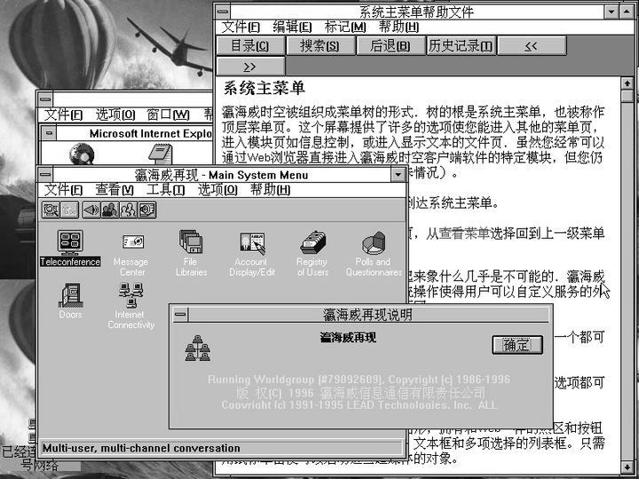
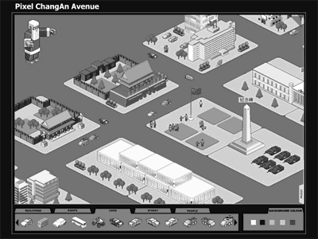

# 人民计算运动：爱好者们是如何塑造中国式数字生活的

“人民计算机”是一个包含一系列装置的小型展览，它希望能够展示关于中国人的数字生活和中文互联网广泛被忽略的历史。今天，国内对计算机和互联网历史的研究还广泛停留在官方话语中，那些并非由大企业和政府主导的实践被广泛的忽视了。个人站长、独立游戏开发者和一系列不同方向的电脑爱好者的贡献都没有得到应有的关注。

*本展品曾在2020年11月21号~2021年5月23号间在新时线媒体艺术中心展出[^1]，原稿以英文写成，内容略有调整。*

这个展览和装置聚焦于对中国的互联网社区产生过重大影响的的几个电脑爱好者团体：包括拨号BBS网络CFido，一个在大众可以访问“互联网”之前就广泛被使用的民间计算机网络；电子词典社区，一个以青少年为主的，在功能有限的小型设备中进行创作，特别是制作电子游戏的社群；Flash动画社区，他们是中国互联网在线视频内容，特别是叙事性的网络视频的先锋；PDA/掌上电脑社区，他们是最早的移动App开发者和移动互联网用户；以及Wi-Fi路由器和固件定制社区，他们是探索无线电信服务应用和嵌入式设备的先锋。

## CFido：互联网之前的网民
CFido是全球性的计算机BBS网络FidoNet的中国分支。它由业余爱好者经营，是中国第一个个人用户负担得起的全国性计算机网络。同时，许多日后最重要的互联网企业家都活跃在CFido上，包括Vencent Qiu（求伯君，金山软件的创始人）和Pony Ma（马化腾，腾讯的创始人）。许多中文互联网术语和俚语都起源于CFido，CFido上也有许多早期的中文ASCII艺术作品。

  
*图1. 配合“虚拟ISP ”运行的瀛海威时空客户端软件*

最近，北京天堂BBS的一张备份光盘被发现并归档。我正尝试研究CFido的技术栈，并重建一个可运行的服务器。同时我也在试图重建瀛海威时空的操作环境，它是中国的第一个互联网服务提供商，重建的“瀛海威”将使用TCP/IP协议，并与流行的调制解调器模拟器（如RetroNet和Wifi232）兼容。

## 电子辞典：教室程序员
中国没有像西方世界，特别是欧洲国家那样有着围绕着8位家用电脑的庞大“卧室程序员”群体，因为在中国销售的大多数8位家用电脑是基于任天堂游戏机的。这些被称作“学习机”的廉价家用电脑在当时更多用来运行（盗版的）游戏卡带。然而，如果我们将目光从8位家用电脑转向其他8-bit的电子设备，如电子词典，就会看到21世纪初中国的青少年们身上那种令人惊叹的创造力。

2000年，中国最重要的电子词典制造商金远见推出了文曲星CC800和PC1000，这两款机型都包括了BASIC语言解释器GV-BASIC，允许用户自己在的电子词典上编程。这一新功能带来了“教室程序员”群体的出现。类似于“卧室程序员”，为电子词典编程的“教室程序员”的主要作品也是电脑游戏。

因此，当我们思考中国手机游戏的历史时，就必须考虑这个传统。在当时，很多青少年没有自己的家用游戏机或PC，但都有过在电子辞典上玩游戏的经历，让他们对移动游戏有着天然的亲近感——这可能是手机游戏最重要的前身。

我的希望能够在一定程度上恢复和归档这段历史，收集当时的开发资料、游戏作品和开发工具。我也希望能够创建一系列的工具软件和操作流程来协助恢复这些创造性的作品。

## Flash动画制作者：互联网上的“故事大王”
在中国，家庭电影的历史与西方世界有很大的不同。在90~2000年代，在中国只有少数人能够制作家庭录像：对于90年代的大多数中国家庭来说，Video8和Hi8这类模拟式家用摄像机都过于昂贵了。在2000年代，家用数字摄像机（DV）的用户群比之前的任何模拟格式都大许多，但仍然非常有限。

相比家用摄像机的曲高和寡而言，电脑动画爱好者群体随着个人电脑的普及而成长起来，Macromedia Flash（后来的Adobe Flash）则是中国爱好者们最常用的工具。与西方世界的Flash爱好者更专注于创作互动内容和游戏不同，中国的爱好者社区更多的是使用Flash来创作故事短片和音乐视频（MV）。

  
*图2. 《像素长安街》是用Flash制作的，并作为demoscene作品发布在pouet.net上。*

在我看来，Flash动画是制作家庭电影的替代路径，因为制作动画的设备比制作视频更便宜：制作视频需要摄像机，以及安装有采集卡、大容量硬盘和高性能CPU，能够运行非线编软件的电脑。而运行Flash并不需要很大的硬盘空间和高性能CPU，也不需要额外的硬件设备。

Flash动画的制作深受日本动漫的影响，也影响了中国的一系列文化活动。一个例子是它对动画电影的孵化：动画电影《大鱼海棠》就是从一部用Flash制作的网络短片开始的。

另一个受Flash影响深刻的领域则是流行音乐：被认为是中国“网络歌曲”起源的《东北人都是活雷锋》流行的起点就是作为Flash动画音乐视频的发布，这种发行没有任何审批流程和准入门槛。从某种意义上讲，Flash社区在中国流行音乐史上起到了“海盗电台”的作用。

Flash社区也助推了网络游戏的发展。虽然中国的Flash爱好者社群在动画方面的成果更加丰富，而游戏的创作则更多由商业机构主导。但Flash本身的普及为游戏开发相关技术建立了一个巨大的人才库。

## PDA社区：移动互联网的前奏
今天，中国拥有世界上最大的移动互联网用户群，有很多中国公司在移动互联网行业崛起，这不仅包括小米、Oppo等硬件制造商，也包括了字节跳动这样的应用开发商。

就像美国的“家酿电脑俱乐部”和其他同时代的电脑爱好者在个人电脑革命中发挥的作用一样，业余爱好者团体在中国的数字化进程中也发挥了重要作用。

90年代末到2000年代初，大量运行Palm OS和Windows Mobile的PDA通过各种 “地下”渠道进入中国，主要是翻新重用的进口电子“洋垃圾”。这些较旧型号的PDA的售价只有原价的四分之一甚至更低，让其在手头不宽裕的学生和年轻上班族中大受欢迎。他们成为手持计算设备的种子用户和较早一批移动应用和游戏的开发者。

当时的Palm中国爱好者们有着许多超前的动作：xurunhua是最早为国内市场开发移动应用程序的开发者之一，他的掌上农历[^2]推出时间甚至早于Palm以“奔迈”品牌进入中国市场[^3]。2004年TomPDA.com就通过J2ME应用程序和离线阅读器AvantGo、Handstory和iSilo提供移动格式的新闻服务，可以被认为是今日头条等新闻应用最早的“概念性证明”。

另外，早期的PDA用户为中国的电子商务做出了很大的贡献：他们建立了早期的网上信用积分系统，使网上购物更加可靠。我也会努力收集他们创造的软件和应用程序，并试图归档和保存中国早期掌上电脑和移动互联网社区的历史。

## 无线黑客：中国物联网和无线技术社区的起源
在2000年代中期Wi-Fi在中国开始流行，与PDA社区的情形类似，无线网络爱好者们往往会使用二手以及废旧的网络设备。2004年起，OpenWRT和DD-WRT社区开始致力于建立替代性的、基于自由软件的无线路由器固件，这其中也伴随着自由软件基金会对思科的诉讼案，最终让所有使用Linux内核的路由器其内核代码都需要开源，并让大量路由器硬件相关的驱动程序对自由软件社区开放。对Linux的兼容性让廉价的二手路由器、因为瑕疵未能上市销售及回收而来的路由器主板（通常称作“裸板”）成为业余爱好者的开发板。

常州恩山公司运行着最活跃的无线路由器和网络设备黑客论坛：恩山无线论坛[^4]。在其中我们可以看到发烧友们对Wi-Fi路由器的各种“魔改”，在发烧友们的手中，路由器变成了“下载机”、网络附加存储（NAS），甚至是区块链矿机。

庞大的Wi-Fi路由器黑客群体为嵌入式软件开发者提供了巨大的人才库。许多产品都是基于“路由器黑客”社区的想法发展而来的：例如，许多具有计费功能的共享WiFi热点，迅雷的玩客云等分发网络（CDN）产品，以及基于X86的路由器系统海蜘蛛等等。

## 研究目标
这一研究的目标是梳理中国黑客文化的历史，探索这些文化是如何影响业界，并塑造今日中国的数字生活的。这将是一个研究型的展览，展示来自黑客社区的创意作品，并尝试将它们转化为适合在博物馆空间体验的形式。它也致力于展示黑客文化、流行文化、技术和社会之间的内在联系。

## 技术规格
作为研究者、档案收集者和硬件及软件的收藏者，它所使用的材料主要来自我自己的收集的软硬件。另外，一些更现代的技术和产品将用以替代过于昂贵或脆弱的设备，或作为“胶水”，把不同的技术连接起来：一个例子是我的在网页里的电脑博物馆(compumuseum.com)中，就利用WebSocket提供了类似telnet和拨号网络的BBS操作环境。展示中将会搭建一个内部网络用于互动体验：它主要基于以太网和Wi-Fi。根据展示的需要，AppleTalk和NetWare等网络协议也可以被加入。

类似的，根据场馆条件和展示需要，可以采用不同的硬件。可能会用到的设备包括：运行DOS或Windows 9x的PC、使用PowerPC处理器的苹果电脑、小型电话交换机、调制解调器、运行PalmOS或Windows CE的掌上电脑。较为复杂的配置，则可能会安装闭路电视调制器和VoIP电话交换机。

## 参考资料
[^1]: CAC · 开幕回顾 | We=Link：辺 http://www.chronusartcenter.org/cac-%C2%B7-%E5%BC%80%E5%B9%95%E5%9B%9E%E9%A1%BE-welink%EF%BC%9A%E8%BE%BA/
[^2]: 【xurunhua作品】掌上农历(支持TT五向轮) https://web.archive.org/web/20030617161505/http://www.echoice.com.cn/bbs/display.asp?luntan=1&forumID=73169
[^3]: Palm掌上电脑正式进军中国 http://tech.sina.com.cn/it/w/2002-12-13/1255155835.shtml
[^4]: 恩山无线论坛 https://www.right.com.cn/