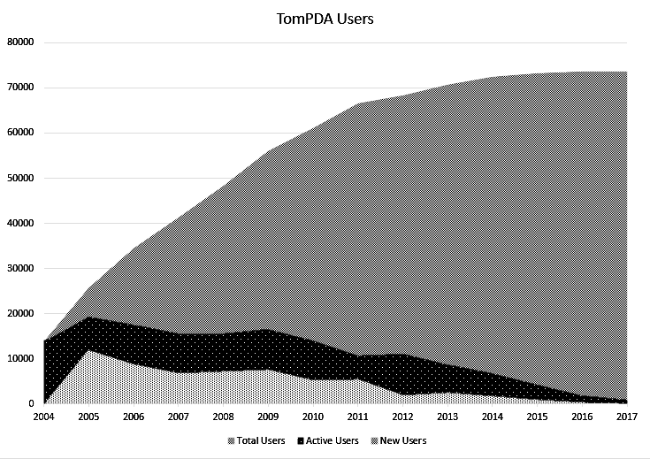
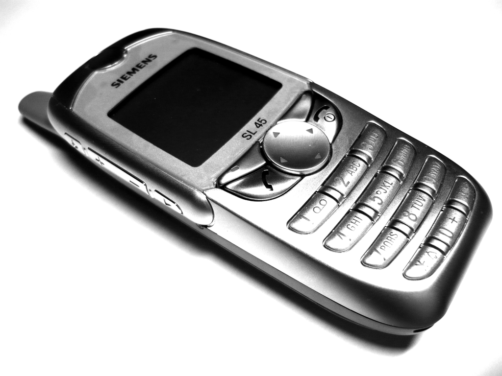
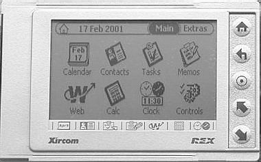

# 我用爬虫掀开了中文移动智能社区的发展史的一角

为了完成我的中国笔电社区的启蒙老师：手持电脑（HPC）与中文社区一文，我花了很多时间去寻找中文社区中HPC流行的过程，但是由于当年Windows CE HPC重镇PDAFANS已经无法访问，许多当年的时间点和价格变的难以考证。

最终我发现中文PDA社区的又一“活化石”TomPDA的信用记录系统保留了大量当时的交易标题，2004年初，后来中国线上交易的第一重镇淘宝网仍然处于萌芽状态，而支付宝也仍未出现。在早期的淘宝交易区，充斥着大量重复的“刷屏”商品。相比之下，TomPDA积极的管理团队，有效的积分系统和中介交易机制，曾经一度是PDA等数码产品交易最为活跃的线上社区。

由于TomPDA信用记录系统没有搜索功能，所以仅靠搜索引擎保留的少量信息仍然难以复原当时的情况。为了复原早期中文PDA社群的交易情况，我用爬虫爬取了整个TomPDA信用记录的数据，得到了从2004年3月4号\~2017年12月31号共414750条交易记录，覆盖73673个独立的ID。

这可能是第一次精确的统计TomPDA论坛的交易规模了，实际上这一规模要比我想象的要小，我估计的交易规模大概是10万以上用户百万以上交易，可能在2005年之后大量的用户选择从TomPDA上看货，而通过支付宝在淘宝上完成交易，导致在TomPDA上加分意愿不高的原因。

| 年份   | 总用户   | 新用户   | 有交易的用户 |
| - | - | - | - |
| 2004 | 13868 |       | 13868  |
| 2005 | 25682 | 11814 | 19386  |
| 2006 | 34419 | 8737  | 17481  |
| 2007 | 41215 | 6796  | 15548  |
| 2008 | 48358 | 7143  | 15567  |
| 2009 | 55978 | 7620  | 16567  |
| 2010 | 61151 | 5173  | 13949  |
| 2011 | 66470 | 5319  | 10678  |
| 2012 | 68290 | 1820  | 10996  |
| 2013 | 70674 | 2384  | 8677   |
| 2014 | 72420 | 1746  | 6732   |
| 2015 | 73322 | 902   | 4141   |
| 2016 | 73562 | 240   | 1803   |
| 2017 | 73663 | 101   | 934    |

我们发现从2005年之后，TomPDA信用记录系统里面的新用户和活跃用户都开始逐步减少，到2017年已不足千人。

通过抓取的TomPDA交易数据，我们能够通过信用的记录准确的得知TomPDA交易系统上线的时间是2004年3月4日凌晨。在这天TomPDA的管理员“胖嘟嘟”作为卖家创建了第一条交易记录，买家是同为TomPDA管理员的“阿猪呆”。但其中最有价值的，还是它复原了当年中文社区里各种机型的起起落落。
## 西门子6688与刷机党
西门子6688（水货版本也叫SL45）是在中文手机用户中的重要群体“刷机党”的起源之一，它是第一款支持插卡（MMC卡）扩展的手机，可以播放MP3。而支持Java应用程序（现在更多叫app）的特性让这部黑白屏幕的功能机具备了类似智能手机的可定制性，而其可定制固件的流行让手机“刷机”不再只是专业维修人员的秘密，而成为发烧友们的日常，许多西门子6688的用户将“刷机”的习惯和技巧带到后来诸多不同机型的用户社群中。

正是因为“刷机党”的存在，让小米先做ROM（MIUI）后做手机的商业模式成为可能，并促成了一系列国产ROM以及刷机精灵、豌豆荚等“手机助手”的出现，构建了当下中国智能手机市场独特的生态。

## 最便宜的REX6000
2004年的初，TomPDA商家奇奇引进了一款不足百元的PDA——REX 6000，让不少对网购仍然心存疑虑的发烧友敢于尝试网购，而这一批“吃螃蟹者”也包括我自己。

这款REX 6000仅有一张普通PC卡大小，本身也是一张标准的PC卡，可以利用笔记本电脑的PC卡插槽和电脑通信，但是它的功能非常有限，无法输入中文，只能看中文电子书。但超过8批团购的巨大用户基础让它不仅刺激了网购社区的发展，也促进了电子阅读，特别是移动阅读社区的形成。

## 千元机的出现
深圳飞力可能是市面上最早提出“千元机”概念的商家，相比当时千元以上的商务通、快译通、联想天玑等封闭系统的PDA，飞力将开放系统的Palm价位拉入千元以内这一属于文曲星等电子词典的价格区间。

飞力“千元机”的出现将线上市场和线下市场拉开了一个巨大的裂口，当爱好者们发现线上市场只需花电子词典的价格就可以买到开放系统的Palm时，他们会义无反顾的“投奔”线上市场。几乎是同一时刻，飞力的Palm和奇奇的REX 6000在“千元”和“百元”的价位上向整个社区进行了一场关于线上购物的“科普”，而此时距离阿里巴巴推出改变交易形态的支付宝要早上大半年。

从某种意义上讲，2005年是中国智能手机市场的“元年”，一方面是大批黑莓的涌入，而另一方面则是由于Sendo X的火爆，是中文Symbian社区爆发的一年。在2005年，线下市场上使用S60系统的智能手机普遍超过2500块钱[^1]，而Sendo X的标价只要1499[^2]，超过1000元的差价刷新了人们对S60手机“高高在上”的认知，而1500元价位也成为日后国产智能手机争夺的重要“战场”。

无论是Palm、黑莓、6688、爱立信、HPC还是MC21，在那个不为人知的“地下市场”，发烧友、商家、网站站长等等不同角色的参与者共同构建了今日中国移动互联网生态的诸多“惯例”，让中国的移动互联网市场显示出与众不同的独特景象。 我在微软的Azure云上搭建了一个简易的查询系统，方便大家查询。[^3]

[^1]: 诺基亚2005年Series60智能手机大回顾 新浪手机 科技时代 新浪网 https://tech.sina.com.cn/mobile/n/2005-12-22/1153799863.shtml
[^2]: 藐杀6600/QD！S60黑马Sendo X真机拆解 https://mobile.zol.com.cn/2005/0627/180867.shtml
[^3]: Tompda交易历史查询 https://tompda.azurewebsites.net/
