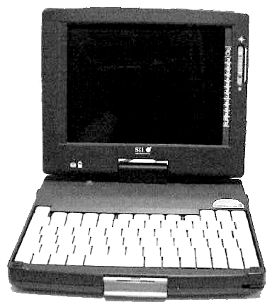
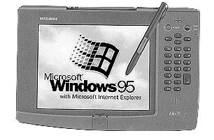
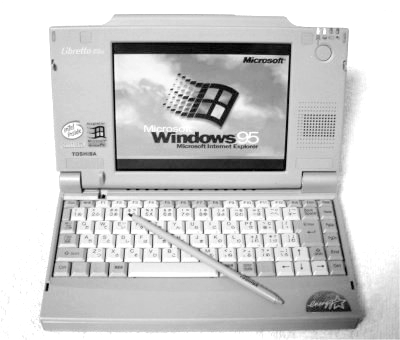

# 中国笔电社区的启蒙老师：“小天才”和它的伙伴们
进入新千年的头五年，对中国民众而言，是互联网全面是渗透进入生活的一段时期，也是第一批“互联网原住民”成长的时代，许多大中型城市纷纷开展宽带网络建设，许多地方512K~2M的宽带网络包月价格已经降至百元以内，以“四千八百八，奔四扛回家”为代表的神舟电脑则让台式电脑的价格变得不再高不可攀，而遍地开花的网吧则是为更多买不起电脑的民众提供了上网的便利。

而在这股“全民触网”的大潮中，也孕育着今日无线互联网繁荣的种子，本书中《中国智能手机社区的启蒙老师：卡西欧MC21》讲述了廉价的卡西欧MC-21掌上电脑对PDA乃至智能手机社区的影响，这一篇文章则将会介绍又一位，哦，是一群“日本老师”对中国互联网社区带来的影响。

正如当年的PDA市场一样，当时的笔记本市场同样是曲高和寡，相比800元起跳的年轻人工资来说，即使国产品牌也要接近万元售价，仍然是普通人难以承受的奢侈品。

但对于最早尝试网购的“吃螃蟹者”们来说，却有一座意外的金矿等着他们——二手洋垃圾笔记本。

## 迷之笔电——“小天才”
关于精工SII “小天才”电脑的资料，即使在其诞生和发行的日本也极其有限，因此也被日本爱好者称作“謎のノートPC”[^1]，从公开的资料看，它在1998年左右获得过日本设计振兴会颁发的优良设计奖[^2]，并和精工当年的另外一件“黑科技”Ruputer手表电脑一起列为“环境友好型”产品。

**精工SII WX-1110**
- CPU AMD Elan SC400 (486SX 相当） 100MHz
- 内存 32MB (on board only)
- 硬盘 2.5 寸2.1GB(MK2110MAT)
- 显示屏 7.8 寸反射型 STN （4096色）
- 通信端口 IrDA， 串口， PS/2， PCMCIA (ver2.1， 非CardBus)
- 显卡 NeoMagic　NM2070
- 声卡 ESS ES1488

这款电脑最早由谁引进中国已不得而知，目前可以查考到最早的价格是广州新中新（pc178.com）在2002年7月18日的报价，650元人民币。当时新中新只称这款小笔记本为“环保超小型手写板AMD-100笔记本”，但许多这款笔记本上面都带有“天才!くん”（天才君）字样的贴纸，因此不久之后就被爱好者们起名为“小天才”。

和新款笔记本十多倍的差价让第一批尝鲜者着实尝到了甜头，小天才的配置虽然在当时已经有些过时，但也足够基本使用，毕竟许多97、98年的台式电脑标配内存也只有32MB，而小天才最大的特点是其AMD嵌入式处理器非常省电，加上使用了不带背光的反射式液晶屏，使其使用时间可以达到5~10小时，即使二手笔电的电池都有不同程度的老化，许多运气好的买家依然可以可以使用超过4个小时，让许多卖家提前体会到了“超长续航”的爽快。同时由于小天才非常小巧便携，也被一些爱好者用在野外作业等场景中

2002年下半年，搭载Windows XP Tablet PC的平板电脑开始出现在市场上，但高企的售价却让大多数人敬而远之。但小天才却是一部“变形本”。让拥有它的玩家提前体会到“平板电脑”的乐趣，但中国真正的平板电脑社区的启蒙老师，确是接下来要讲到的三菱Amity VP。

## Win98平板——小三菱
就在“先遣队”小天才登陆后的短短几个月之后，三菱Amity VP的出现算是正式拉开了洋垃圾笔记本“黄金时代”的序幕。

**三菱 AMiTY VP**
- CPU：AMD Am5x86(TM)-P75 133Mhz（性能接近于Pentium 75MHz）
- 内存：16MB，可以扩展到48MB（进入中国时多数被升级到32M）
- 硬盘：800MB
- 显示屏：7.5寸DFPassive液晶（DFPassive）65536色，分辨率640×480
- 输入方式：无需电池的电磁触控笔
- PC卡插槽：TYPE II×2或TYPE III×1(JEIDA4.2/PCMCIA2.1标准兼容)
- 声卡：Sound Blaster Pro兼容、内置麦克风和单声道扬声器
- 红外线通信功能：IrDA 1.1
- 电源：锂离子电池，最多两块
- 续航时间：单电池2小时，双电池2.5小时

全套配置的小三菱平板电脑会包含外置光驱、软驱和键盘。同时小三菱有几个不同的版本，按键区域略有不同。此外小三菱自带一个保护盖，可以防止屏幕被刮花。

小三菱的硬件配置相比小天才要高出不少，特别是小天才的屏幕类似早期的GBA没有背光，在室内操作多有不便，而小三菱的屏幕却是DSTN屏幕中亮度最高的类别，虽然比不上当时主流笔记本的TFT液晶屏，但足以满足一般使用的需求了。小三菱配备的电磁触控笔更是高端Tablet PC上才有的功能。在当时，只需要花比小天才略高的价钱，就可以买回一部“Tablet PC”，让这款小三菱迅速的热度迅速攀升。而充足的货源也让小三菱不再是网购“吃螃蟹者”的专属，许多二线城市的电脑市场也可以买到，因此，小三菱也成为为数不多的被百度百科收录的“洋垃圾”之一[^3]。平板外形的小三菱很适合安装在汽车上，也是中国车载电脑社区最早广泛使用的机型之一。

## “小萝卜头”——东芝Libretto 50m
2000年之后，笔记本电脑正在经历一股小型化的浪潮，特别是全美达（Transmeta）的Crusoe处理器出现之后，索尼推出了UMPC的前身VAIO PCG-U1，加上之前的超小型笔记本C1，让超便携笔记本成为爱好者们“发烧”的新目标。不过与Tablet PC一样，高昂的售价让大多数爱好者都望而却步。不过热爱淘宝的爱好者们很快就发现了替代品——东芝Libretto 50m。

**东芝Libretto 50m**
- CPU：Pentium 75MHz（许多商家超频到133Mhz）
- 内存：16MB，可以扩展到32MB
- 硬盘：810MB
- 显示屏：6.1寸TFT液晶1600万色，分辨率640×480
- 输入方式：电阻式触控笔
- 通信端口：IrDA红外线，PCMCIA

受当时技术的限制，小萝卜头以今天的眼光看来可以算得上是“超厚”型，但小巧的体积和低廉的价格仍然让其大受欢迎。

东芝Libretto 50m原本是1997年东芝为明治生命保险公司（2004年与安田生命保险公司合并为明治安田生命保险公司）定制的专用型笔记本电脑，在原型机50ct（标题图片）的基础上加装了触摸屏，维基百科上资料显示这批电脑总共有4万台左右，从进入中国之后的流行程度来看，几乎是在2002年退役之后全部被买到中国。

萝卜头50M可以算作是小天才的升级版，奔腾75Mhz处理器由于超频能力优异，被许多商家超频到133Mhz售卖，超频后的小萝卜头性能强劲，可以运行《暴力摩托》等3D游戏，性能高出小天才的486 100Mhz和小三菱的5x86 133Mhz不少。而小萝卜头的TFT液晶屏的显示效果也比前两者更加优秀，因此在数码相机爱好者中间也颇为流行，许多玩家拿来用它做数码伴侣存储和查看照片。

小萝卜头更换硬盘非常方便，不仅让喜欢折腾系统的玩家重装系统更加快速，喜欢外出摄影的玩家也在安装大容量硬盘之后将其作为数码伴侣。

小萝卜头提供了一个PCMCIA扩展槽，可以安装无线网卡。安装了无线网卡的小萝卜头也成了许多玩家的“蹭网利器”

## 星星之火
在小天才、小三菱、小萝卜头这“东瀛三宝”进入中国后的半年里，引发了越来越多爱好者的关注，相比当时市场上占主流的商务型笔电和PDA，这些“奇怪的小电脑”体积和重量要明显小于商务型笔电，而功能则明显强于PDA，最重要的是，它的价格仅仅是其余两者的几分之一。小巧实用的小萝卜头不仅受到个人用户的欢迎，甚至被大专院校批量采购，用于美术高考阅卷。

当然，在电脑仍然算大件消费品的2002、2003年，货源和价格混乱，缺乏保修的“东瀛三宝”仍然让大多数普通用户望而却步。它们的第一批爱好者中，不少在也是其它圈子里的发烧友，这其中就包括了数码摄影爱好者、无线网络爱好者、硬件改装爱好者、车载电脑爱好者和PDA爱好者等等，当年的这批爱好者都几乎成了自己所在圈子中最资深的玩家，而日系小笔电社区，则是这其中的的交集之一。而正是这批在线社区的意见领袖，定下了中文社区偏爱轻薄型小笔电的基调。

## 社区的形成
相比MC21，小笔记本社区的形成更加难以查考，或许由于小笔记本运行的系统与普通电脑一样是Win95、98，所以许多问题在一般的电脑论坛就可以得到解决，而不像MC21等PDA那样需要解决汉化等特殊的问题。

小天才之家有可能是最早的小笔电讨论网站，网站的大部分内容发布于2003年1月，介绍了一些适合于小天才笔记本运行的软件和笔记本驱动安装等使用技巧。

mcwinny所开设的迷你天下网站及色天地摄影论坛（已于2016年关闭）是讨论东芝小萝卜头的专门论坛。精美照片、硬件改装（如内置USB转PS/2鼠标接口）和摄影相关外设（如PCMCIA转储存卡读卡器）是该站的主要特色。

与我们在MC21社区看到的情形类似，小笔记本社区同样广泛存在着“以商养坛”的形态，迷你天下就在开办交流论坛的同时，也出售相关的硬件产品。2003年底小笔记本社群最热门的配件之一，是GPS导航接收器。

小笔记本社群的另一个重要网站是“天才梦工厂”，从名字可以看出小天才笔记本似乎是这一论坛创立的起因，但该论坛经过一段时间的发展，MC-21逐渐取代小天才笔记本这个论坛最为热门的话题。

## 电池专门网
在小笔记本社区中影响最大的一家论坛，或许要属“电池专门网”（ilove3d.net）了，由于许多二手小笔记本在进入中国市场之时已经使用多年，多数电池都已经老化，而为老笔记本电池更换电芯的业务也因此出现，此时适逢国内锂电池产能爆发之时，像比亚迪、邦凯科技等锂离子电池企业产能的激增让锂电池的价格迅速下降，“换电芯”在笔记本社区里蔚然成风。时至今日，我们仍然能找到一些重现当年爱好者自己动手换电芯的经历的旧文[^4]。

但给笔记本电脑换电芯实属一项技术活，手艺不精的话可能会把电池电路板拆坏，甚至有爆炸的危险，因此一些“民间高手”开始在网上经营换电芯的生意，而电池专门网的创始人ilove3d就是其中之一。

MC21在ilove3d论坛中同样也颇具人气，由于渠道的类似，小笔记本社区和MC21社区之间总是有着千丝万缕的联系。

## 后续有人
日系小笔记本的热潮在2006年后达到顶峰，富士通253L，夏普A230在陆续进入中国市场，而私家车和自驾旅行的流行更是为此推波助澜。

Pentium II级别的夏普A230被视为小三菱的替代品，和小三菱同样的平板电脑设计让它也时常被安装在汽车上使用[^5]。此外该机型也被收录在百度百科中[^6]。

富士通Lifebook FMV-253L使用了全美达的CPU，加装厚电池的253L可以连续运行4个小时，强劲的续航能力以及手写功能让它成了东芝小萝卜头和小天才的最佳继任者，同时它也是车载改装的热门机型之一[^7]。

此外，东芝萝卜头Libretto 50m/50ct的后续机型100ct，110ct，富士通的Lifebook FMV-650/670等机型都在国内有着不小的用户群体。

## 上网本的出现与“洋垃圾”时代的结束
从2002年小天才进入中国，到2007年“洋垃圾”笔记本已经流行了5个年头，这五年间中国的电脑市场已经发生了翻天覆地的变化，“价格屠夫”神舟电脑以一年一千块的速度刷新着笔记本电脑的低价记录，虽然当时的廉价笔记本存在着模具粗糙，品控不严等等问题，但是低廉的价格，庞大的销售和服务网络还是让口袋并不宽裕的消费者们纷纷“上船”。

但日系笔记本社区此时却可以“置身事外”，日系小笔记本的爱好者相比性能而言，更看重笔记本电脑的做工、轻便、手写这样的独特功能，以及国际品牌带来的“虚荣心”。

2007年底，华硕的EeePC的出现，掀起了笔记本电脑市场中“上网本革命”，我们目前仍不清楚EeePC是否曾经收到日系小笔电的启发，但笔者认为，EeePC更可能是UMPC和OLPC的混血儿。

2006年上市的三星Q1是最早出现在市场上的UMPC（Ultra-Mobile PC - 超移动电脑）之一，其使用的7寸1024x600显示屏及Celeron M处理器都与初代的EeePC极为相似。

OLPC（One Laptop Per Child 一童一电脑） XO-1，是2005年，由《数字化生存》一书的作者尼葛洛庞帝牵头组织的一个非盈利组织，旨在设计100美元的笔记本电脑，并提供给发展中国家。

但无论是有意为之还是无心之举，受EeePC冲击最大的，正是日系小笔电市场，EeePC与日系小笔电有着相似的体积和重量，更长的续航时间和国际品牌的做工，而最重要的，是远低于UMPC的价格，EeePC上市时的价格就不到3000人民币，虽然相比千元左右的二手日系小笔记本仍有差距，但更好的性能、和较完善的保修渠道还是让日系小笔电的爱好者们逐渐的“跳槽”到上网本的阵营当中。

中国的3G网络的建设速度随着2008年北京奥运会的临近而逐渐加快，3G数据卡也被加入到不少“上网本”的配置当中，“移动互联网”的大幕终被拉开，接下来的几年里，智能手机、MID、上网本、平板电脑等移动设备层出不穷，而已是明日黄花的日系小笔电则逐渐淡出人们的视野。

而当年日系小笔电交流的重镇电池专门网，则在2009年初的一次故障中丢失了2007、2008两年全部的数据，最终在2010年夏天关闭，而ilove3d本人则似乎转战Android ROM社区，成了“刷机党”中一个不大不小的人物。

## 影响
2008年之后，日系小笔电的热潮逐渐退去，其地位也逐渐被上网本所取代，但其影响力却并未因此结束。日系小笔电给中国的笔记本电脑社区留下的最为显著的遗产，应该是中国市场对于轻薄型笔记本的偏爱，在相当长的一段时间里，中国市场上笔记本尺寸的上限一直是14英寸级别，而13英寸被奉为“黄金尺寸”，15寸以上的笔记本鲜有问津，直到近年来游戏本和高分辨率屏幕开始流行才有所改观，“工人舍”等口袋笔记本也一度受到不少人追捧。与之相比，西方世界中15寸一直是主流尺寸，而17寸笔记本亦不鲜见。反而是12寸以下的超小型笔记本完全不见踪影。

此外日系“洋垃圾”笔记本还造就了一个“千元笔记本”市场，1000元人民币以内的便携电脑的需求并未因日系笔记本的退出而结束，实际上，紧随日系“洋垃圾”笔记本之后进入中国市场的二手欧美品牌商务笔记本在这一时期吸收了大量用户，特别是IBM ThinkPad用户社区在这一时期飞速增长，像T41，T43等一些机型至今仍被许多用户视作ThinkPad笔记本的巅峰之作。

在市场的另一面，一批装载Windows CE系统和ARM处理器的“笔记本”以相似的价格区间出现在电视购物节目中，虽然这类产品就因为夸大的宣传和阳春的功能被网上社区口诛笔伐，但仍然“顽强地”存活了许多年。

2014年，799元的酷比魔方iwork8的出现，让百度帖吧等网上社区中掀起了又一股平板电脑的热潮，年轻一代的爱好者基本没有人会了解当年日系手写小笔电和平板电脑在中国的风光，只有像TouchMousePointer这样的Win8平板必备软件，才会让笔者这样的亲历者回忆起当年“日本老师”们给予中国移动互联网社区的启发。

## 参考资料
[^1]: sorriman：謎のノートPC「WX-1110ｚ」 https://plaza.rakuten.co.jp/sorriman/002000/
[^2]: Good Design Award 業務用パーソナルコンピューター [SII WX-1110] http://www.g-mark.org/award/describe/24742
[^3]: 小三菱amity手写板笔记本_百度百科 https://baike.baidu.com/item/%E5%B0%8F%E4%B8%89%E8%8F%B1amity%E6%89%8B%E5%86%99%E6%9D%BF%E7%AC%94%E8%AE%B0%E6%9C%AC/2107118
[^4]: 简简单单,IBM600E老本子电池换芯记 https://diy.zol.com.cn/2003/0226/55640.shtml
[^5]: 用a230装备威驰------GPS DIY！https://www.xcar.com.cn/bbs/viewthread.php?tid=2109155
[^6]: sharp A230_百度百科 https://baike.baidu.com/item/sharp%20A230
[^7]: 总结俺OO上所有添置的东东(3月18日15：00更新完毕) https://www.xcar.com.cn/bbs//viewthread.php?tid=7216766&page=3